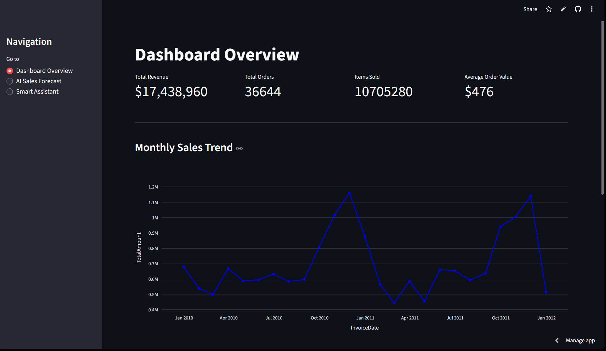
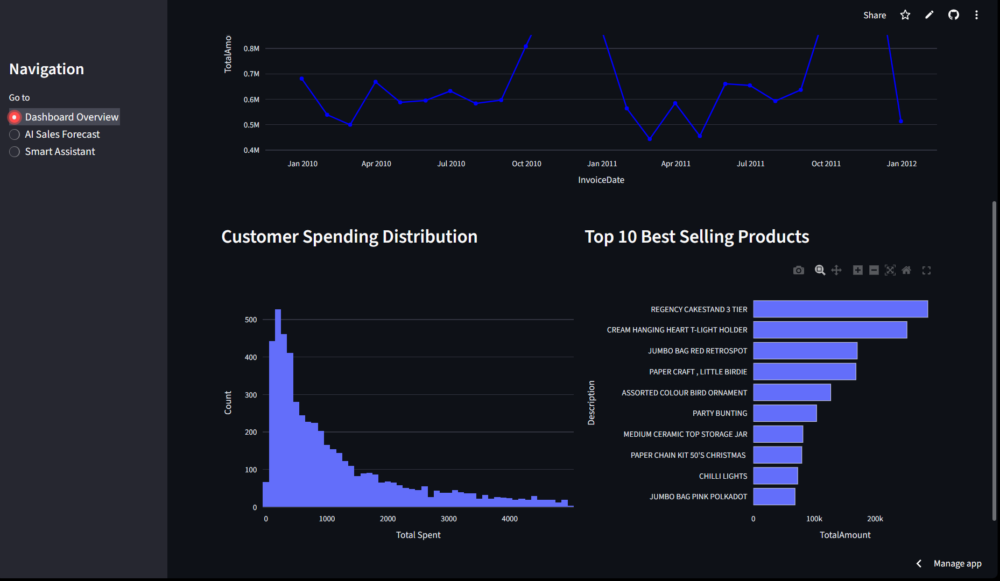
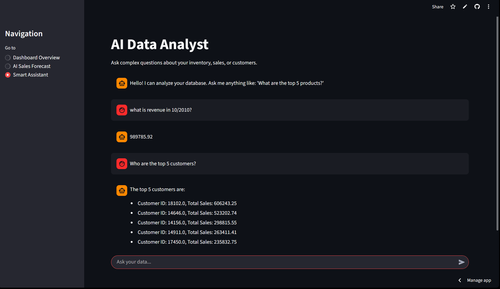
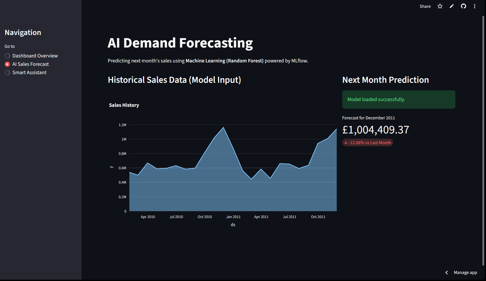

# Smart Inventory System 📊🤖

An AI-powered inventory management and analysis system that combines **Data Analytics**, **Demand Forecasting (Random Forest)**, and a **GenAI Smart Assistant (LangChain + Groq/Llama4)** to help businesses optimize stock and understand sales trends.

## 🚀 Live Demo

[Click here to try the App!](https://smart-inventory-system1.streamlit.app/)

## 📸 Screenshots

### 1. Business Dashboard




### 2. AI SQL Agent (Chatbot)

> The agent can answer complex queries about sales and customers.
> 

### 3. Demand Forecasting



---

## 🌟 Features

### 1. 📈 Dashboard Overview

- Real-time KPIs: Total Revenue, Total Orders, Items Sold, Average Order Value.
- Visualizations: Monthly Sales Trend (Line Chart), Top 10 Best Selling Products (Bar Chart).

### 2. 🔮 AI Sales Forecast

- Predicts next month's sales using a **Random Forest Regressor**.
- Uses MLflow for experiment tracking and model management.
- Trains on historical sales data to forecast future revenue growth.

### 3. 💬 Smart AI Assistant

- A natural language chatbot powered by **Groq (meta-llama/llama-4-scout-17b-16e-instruct)** and **LangChain**.
- Connects directly to the SQLite database in **Read-Only** mode.
- Answers questions like:
  - "What are the top 5 distinct products?"
  - "Calculate total revenue for 2011."
  - "Who is the customer with the highest number of orders?"
- **Security Guardrails**: Blocks malicious SQL commands (DROP, DELETE, UPDATE, etc.).

---

## 🛠️ Technology Stack

- **Frontend**: [Streamlit](https://streamlit.io/)
- **AI & LLM**: [LangChain](https://www.langchain.com/) + [Groq API](https://groq.com/)
- **Machine Learning**: [Scikit-learn](https://scikit-learn.org/), [MLflow](https://mlflow.org/)
- **Database**: SQLite
- **Data Processing**: Pandas, NumPy
- **Visualization**: Plotly

---

## 🚀 Setup & Installation

### 1. Clone the Repository

```bash
git clone https://github.com/yousefmohtady1/smart-inventory-system.git
cd smart-inventory-system
```

### 2. Create Virtual Environment

```bash
python -m venv venv
# Windows
venv\Scripts\activate
# Mac/Linux
source venv/bin/activate
```

### 3. Install Dependencies

```bash
pip install -r requirements.txt
```

### 4. Set Up Environment Variables

Create a `.env` file in the root directory and add your Groq API Key:

```env
GROQ_API_KEY=your_groq_api_key_here
```

---

## 🏃‍♂️ Usage

### 1. Download Dataset

Run the script to download and prepare the dataset:

```bash
python -m src.data_ingestion.download_data
```

### 2. Initialize the Database

Process the raw data and create the SQLite database:

```bash
python -m src.database.db_manager
```

### 3. Train the Sales Forecast Model

Before running the app, train the machine learning model to generate a forecast:

```bash
python -m src.ml.train_model
```

_This will train the Random Forest model and log artifacts to MLflow._

### 4. Run the Streamlit App

Start the dashboard and AI assistant:

```bash
streamlit run app.py
```

### 5. Access the App

Open your browser at: `http://localhost:8501`

---

## 📂 Project Structure

```
smart-inventory-system/
├── data/                   # Raw data (Excel/CSV)
├── mlruns/                 # MLflow experiment tracking
├── src/
│   ├── agents/             # SQL Agent logic (LangChain)
│   ├── config/             # Settings and constants
│   ├── data_ingestion/     # Scripts to download data
│   ├── database/           # Database management
│   ├── ml/                 # Machine Learning training & prep
├── app.py                  # Main Streamlit Application
├── requirements.txt        # Python Dependencies
└── README.md               # Project Documentation
```

---

## 🔒 Security Note

The SQL Agent is configured with **read-only access** and includes **input guardrails** to prevent unauthorized database modifications.
